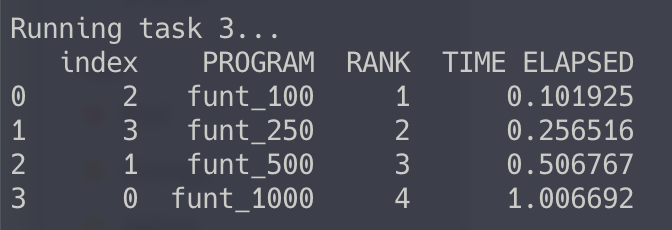
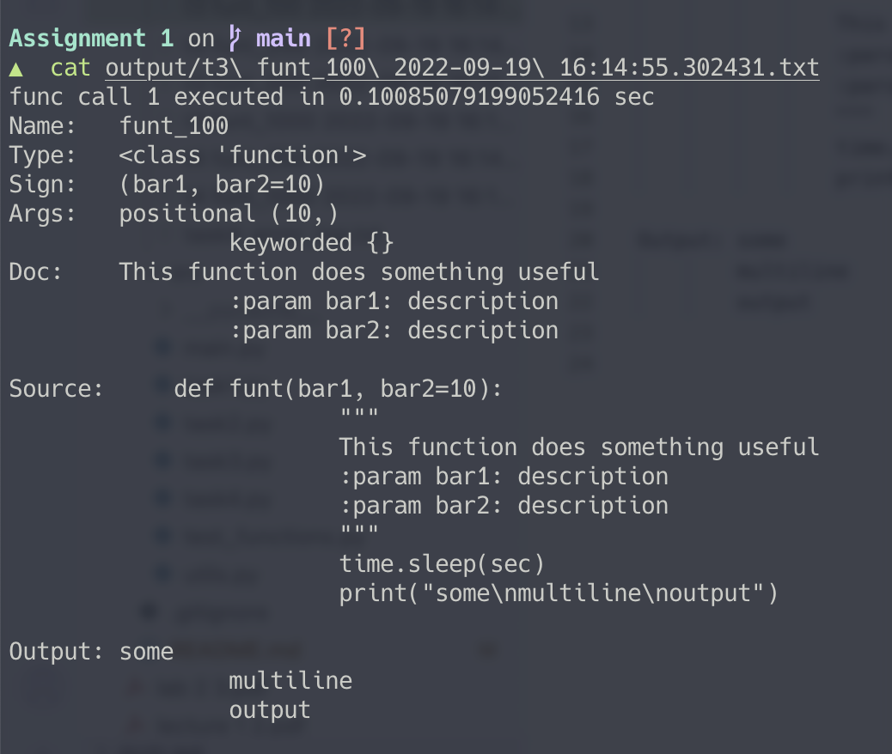
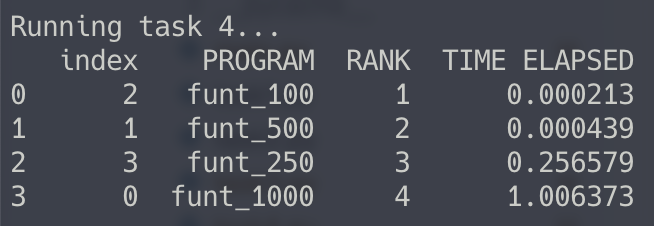
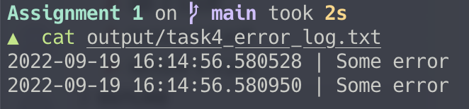

# Assignment 1

A repo for running task from assignment 1. 


## Run

From project root directory run command
```
python src/main.py --run_all
```

## Advanced options
To specify concrete task, use flags --run_task_[number]

Example:
```
python src/main.py --run_task_1 --run_task_4
```

## Task 1


## Task 2


## Task 3




## Task 4




Salavat Dinmukhametov 